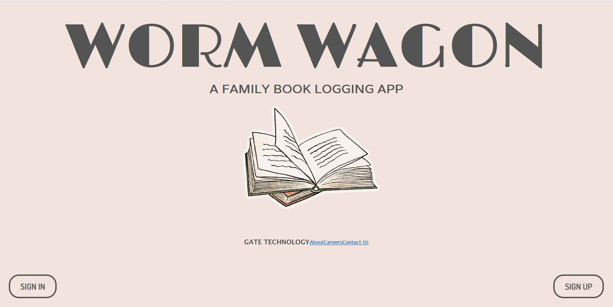
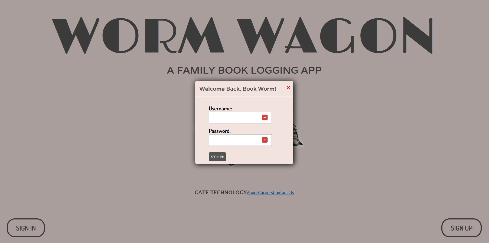
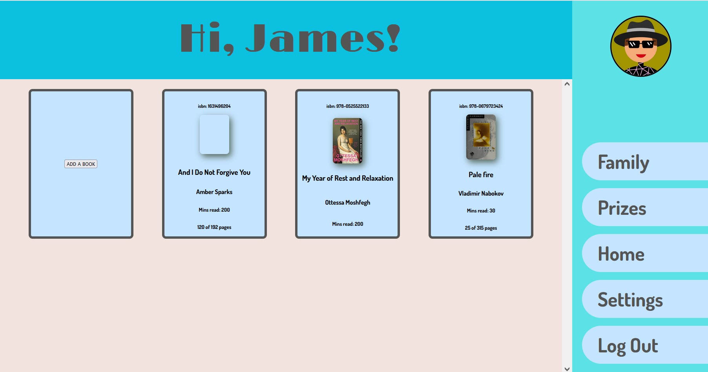
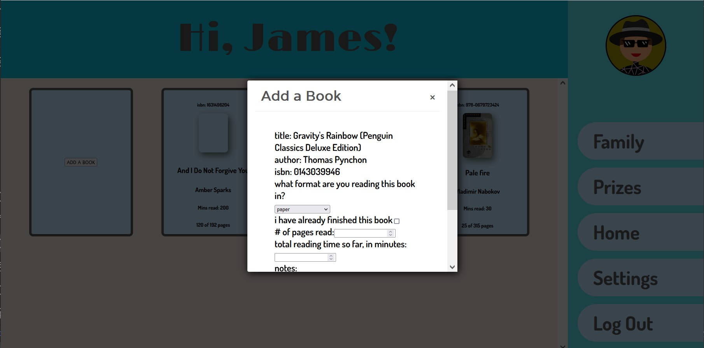

# FamilyBookTracker
Full-stack application to allow families to track their reading 
- written in Vue.js with a Java backend
- book data pulled from an external API (openlibrary.org)
- reading data (book format, pages/minutes read, reading notes) can be edited by users
- book and user data stored persistently in PostgreSQL database

